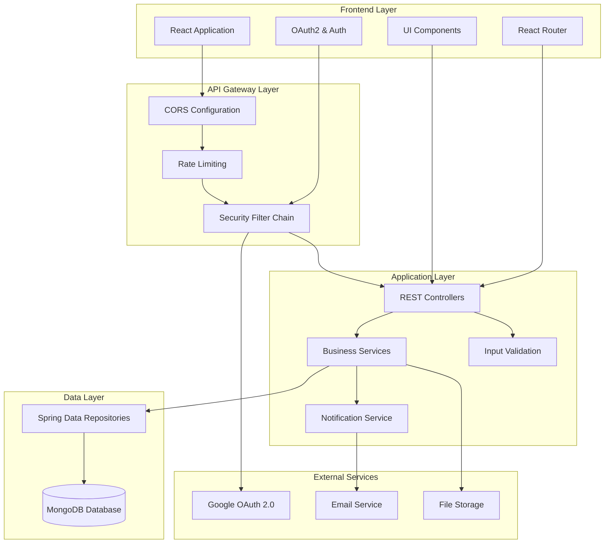
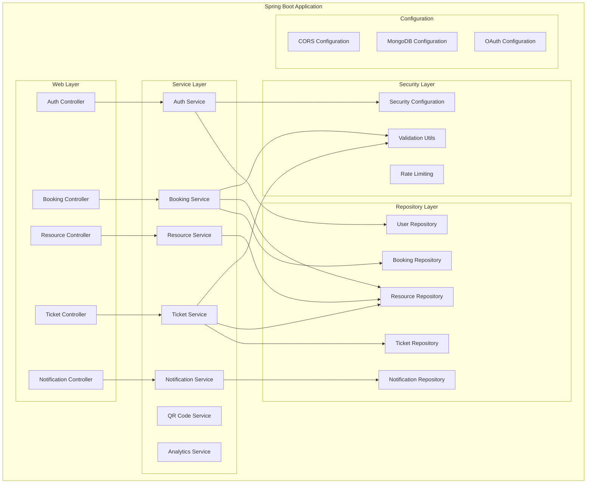
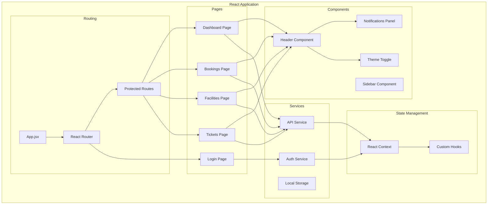
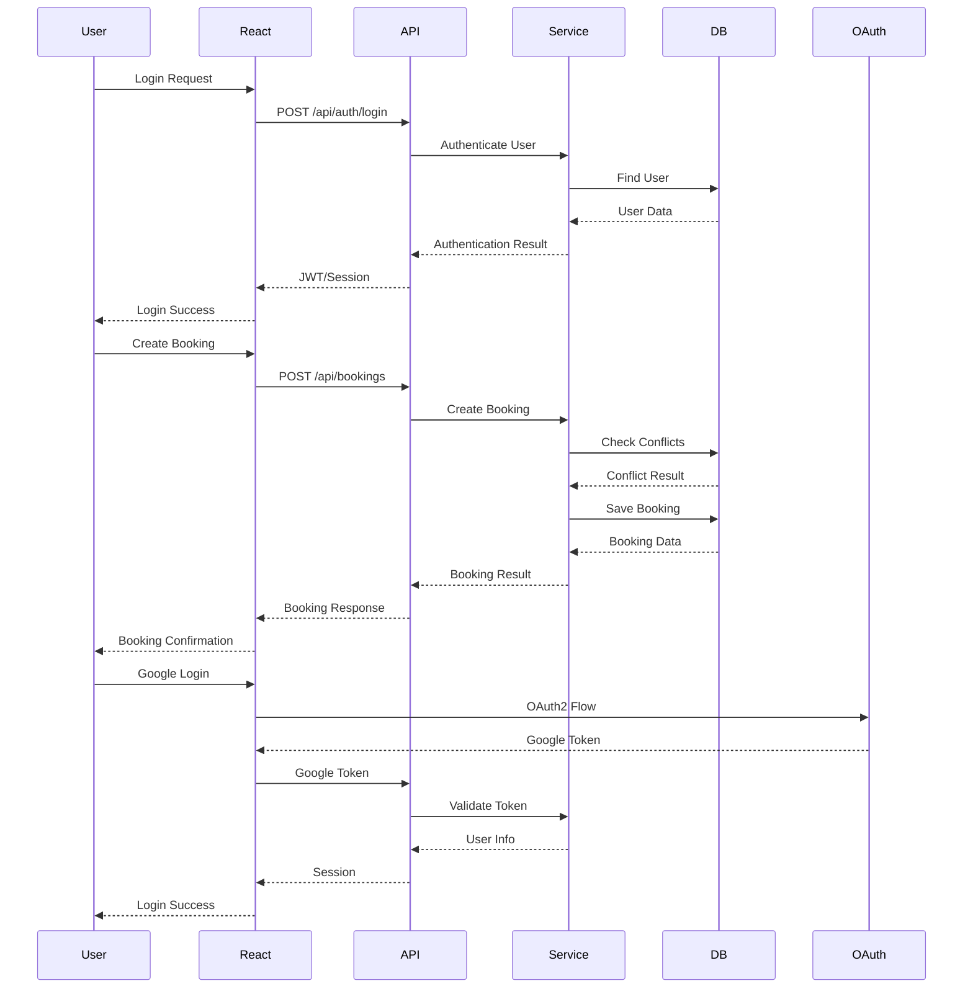
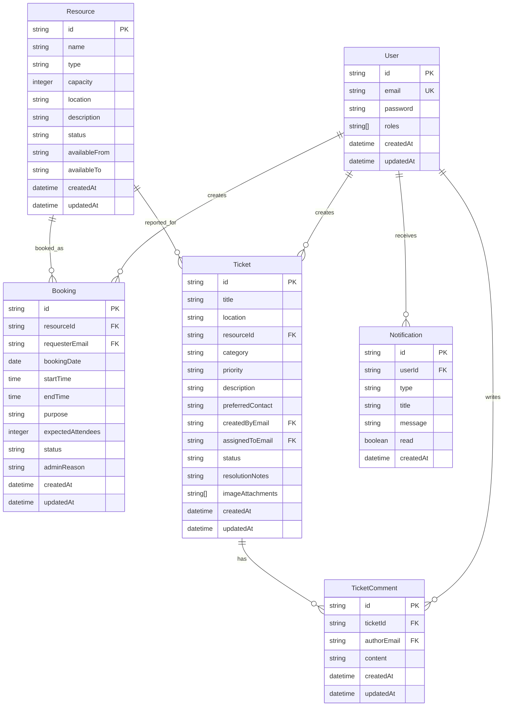
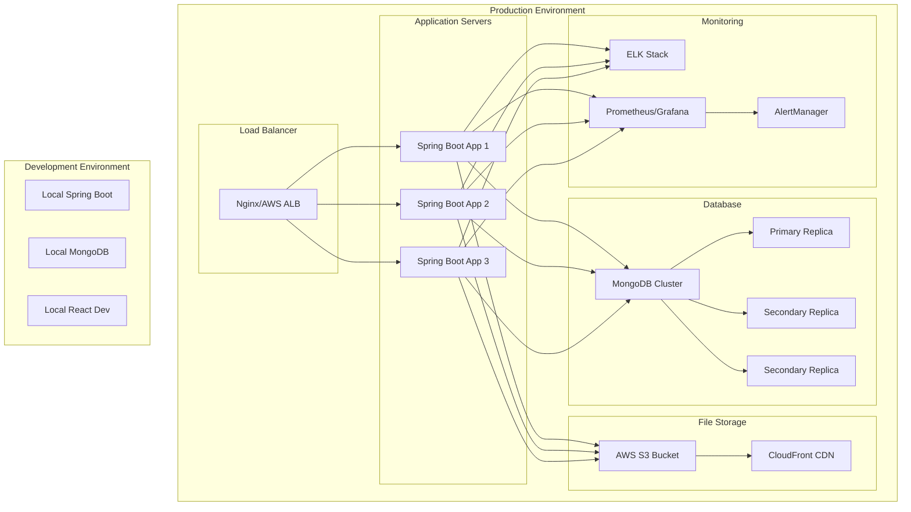

# Smart Campus Operations Hub - System Architecture

## Overall System Architecture

## Backend Architecture

## Frontend Architecture

## Data Flow Architecture

## Security Architecture

```mermaid
graph TB
    subgraph "Security Layers"
        subgraph "Network Security"
            HTTPS[HTTPS/TLS]
            CORS[CORS Policy]
            RateLimit[Rate Limiting]
        end
        
        subgraph "Authentication"
            OAuth2[OAuth 2.0]
            JWT[JWT Sessions]
            LocalAuth[Local Authentication]
        end
        
        subgraph "Authorization"
            RBAC[Role-Based Access Control]
            MethodSecurity[Method Security]
            URLSecurity[URL Security]
        end
        
        subgraph "Input Security"
            Validation[Input Validation]
            Sanitization[XSS Protection]
            FileValidation[File Upload Security]
        end
        
        subgraph "Data Security"
            Encryption[Password Encryption]
            DataSanitization[Data Sanitization]
            AuditLogging[Audit Logging]
        end
    end
    
    HTTPS --> CORS
    CORS --> RateLimit
    RateLimit --> OAuth2
    RateLimit --> LocalAuth
    
    OAuth2 --> JWT
    LocalAuth --> JWT
    JWT --> RBAC
    
    RBAC --> MethodSecurity
    RBAC --> URLSecurity
    
    MethodSecurity --> Validation
    URLSecurity --> Validation
    Validation --> Sanitization
    Validation --> FileValidation
    
    Sanitization --> Encryption
    FileValidation --> Encryption
    Encryption --> DataSanitization
    DataSanitization --> AuditLogging
```

## Database Schema

## Deployment Architecture

## Technology Stack

### Backend Technologies
- **Framework**: Spring Boot 3.3.5
- **Language**: Java 21
- **Database**: MongoDB with Spring Data MongoDB
- **Security**: Spring Security with OAuth 2.0
- **Validation**: Jakarta Bean Validation
- **Rate Limiting**: Resilience4j
- **QR Code**: Google ZXing
- **Testing**: JUnit 5, Mockito, Spring Boot Test
- **Build Tool**: Maven

### Frontend Technologies
- **Framework**: React 19.2.4
- **Routing**: React Router 7.13.2
- **Styling**: TailwindCSS 3.4.19
- **Build Tool**: Vite 8.0.1
- **Testing**: Playwright 1.59.1
- **Package Manager**: npm

### DevOps & Infrastructure
- **Version Control**: Git with GitHub
- **CI/CD**: GitHub Actions
- **Containerization**: Docker
- **Cloud Provider**: AWS (for production)
- **Monitoring**: ELK Stack, Prometheus
- **Load Balancer**: Nginx/AWS ALB

## API Design Patterns

### RESTful Design Principles
- **Resource-based URLs**: `/api/resources`, `/api/bookings`, `/api/tickets`
- **HTTP Methods**: GET, POST, PUT, PATCH, DELETE
- **Status Codes**: Proper HTTP status codes
- **Content Negotiation**: JSON responses
- **Stateless**: JWT-based authentication

### Error Handling Patterns
- **Global Exception Handler**: Centralized error handling
- **Validation Errors**: Structured error responses
- **Custom Exceptions**: Business-specific exceptions
- **Logging**: Comprehensive error logging

### Security Patterns
- **Defense in Depth**: Multiple security layers
- **Principle of Least Privilege**: Minimal required permissions
- **Input Validation**: All inputs validated and sanitized
- **Secure Headers**: Security headers configured

## Performance Considerations

### Database Optimization
- **Indexing**: Proper MongoDB indexes
- **Query Optimization**: Efficient database queries
- **Connection Pooling**: Database connection management
- **Caching**: Redis for frequently accessed data

### Application Performance
- **Async Processing**: Non-blocking operations
- **Rate Limiting**: Prevent abuse
- **Lazy Loading**: Efficient data loading
- **Pagination**: Large result sets

### Frontend Performance
- **Code Splitting**: React lazy loading
- **Asset Optimization**: Minified CSS/JS
- **Caching**: Browser caching strategies
- **CDN**: Static asset delivery

## Scalability Architecture

### Horizontal Scaling
- **Stateless Design**: Easy horizontal scaling
- **Load Balancing**: Distribute traffic
- **Database Sharding**: MongoDB sharding
- **Microservices Ready**: Modular architecture

### Vertical Scaling
- **Resource Monitoring**: Performance metrics
- **Auto-scaling**: Dynamic resource allocation
- **Database Optimization**: Query performance
- **Caching Layers**: Multiple cache levels

This architecture provides a solid foundation for the Smart Campus Operations Hub with security, scalability, and maintainability as key design principles.
